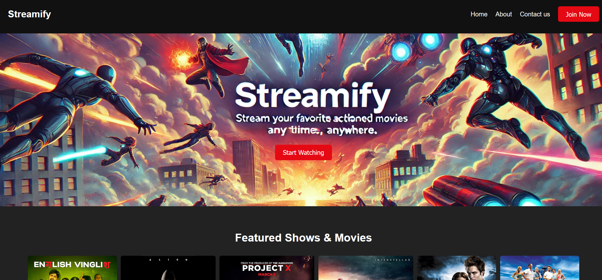

# Streamify

Streamify is a movie streaming platform that allows users to stream their favorite movies in different resolutions. It features a seamless login and registration experience using SSO (Single Sign-On) via OneAccess. Admin users can upload movies, which are then stored in MinIO and transcoded into multiple resolutions for the best user experience.



## Features

- **User Authentication & Registration:** Secure login and registration using SSO via OneAccess.
- **Admin Dashboard:** Admins can upload movies, which are stored in MinIO and transcoded to different resolutions.
- **Streaming Service:** Users can browse, select, and stream movies in various resolutions based on their network bandwidth.
- **Responsive UI:** The user interface is fully responsive and user-friendly.

## Technologies Used

- **Frontend:** React
- **Backend:** FastAPI
- **Storage:** MinIO for storing media content
- **Transcoding:** Automated transcoding of uploaded movies to multiple resolutions
- **Authentication:** SSO (Single Sign-On) with OneAccess

## Installation

Follow these steps to set up the project locally:

### Prerequisites

- **Node.js** and **npm** installed on your machine
- **Python 3.8+** installed
- **Docker** and **Docker Compose** installed (for MinIO and other services)

### Frontend (React)

1. Clone the repository:
    ```bash
    git clone https://github.com/kunal-paul04/Streamify.git
    cd Streamify/frontend
    ```

2. Install dependencies:
    ```bash
    npm install
    ```

3. Create a `.env` file in the `frontend` directory and configure the backend URL:
    ```env
    REACT_APP_BACKEND_URL=http://localhost:8000
    ```

4. Start the frontend:
    ```bash
    npm start
    ```

5. The frontend will run on `http://localhost:3000`.

### Backend (FastAPI)

1. Navigate to the backend directory:
    ```bash
    cd Streamify/backend
    ```

2. Create a virtual environment and activate it:
    ```bash
    python -m venv venv
    source venv/bin/activate  # On Windows: venv\Scripts\activate
    ```

3. Install dependencies:
    ```bash
    pip install -r requirements.txt
    ```

4. Set up environment variables by creating a `.env` file in the `backend` directory with the following content:
    ```env
    MINIO_ENDPOINT=http://localhost:9001
    MINIO_ACCESS_KEY=your_minio_access_key
    MINIO_SECRET_KEY=your_minio_secret_key
    ```

5. Start the backend server:
    ```bash
    uvicorn main:app --reload
    ```

6. The backend will run on `http://localhost:8000`.

### MinIO Setup

1. Use Docker Compose to set up MinIO:
    ```bash
    docker-compose up -d
    ```

2. MinIO will be available at `http://localhost:9001`. Use the credentials from the `.env` file to access it.

## Usage

1. **Admin Panel:** Login as an admin to upload and manage movies.
2. **User Panel:** Register and browse available movies. Select a movie to start streaming in the desired resolution.

## Contributing

If you want to contribute to Streamify, feel free to open an issue or submit a pull request.

## Developers

- **Satish Sinha** - [GitHub Profile](https://github.com/satishsinha)
- **Kunal Paul** - [GitHub Profile](https://github.com/kunal-paul04)

## License

This project is licensed under the MIT License.
